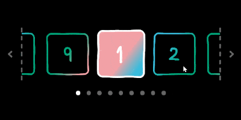
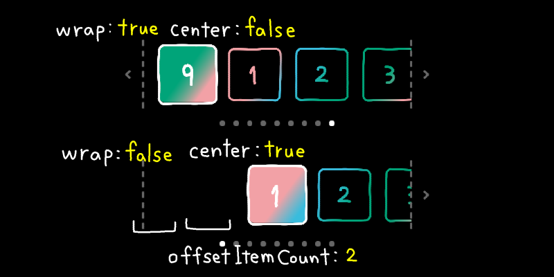

# Horizontal Carousel for Unity UI Toolkit



A horizontal carousel custom control for Unity UI Toolkit.

## Features
- Inspired by UI Toolkit's ListView
- Recycles a fixed number of items
- Built with a flex layout
- Supports Runtime Binding
- Supports drag scrolling
- Supports both relative (`ScrollBy`) and absolute (`value`) navigation

```xml
<!-- Example UXML -->
<HorizontalCarousel visible-item-count="5" fixed-item-width="200" item-template="CardItem.uxml">
    <!-- Runtime Binding -->
    <Bindings>
        <ui:DataBinding property="itemsSource" data-source-path="cards" binding-mode="ToTargetOnce"/>
        <ui:DataBinding property="value" data-source-path="selected" binding-mode="TwoWay"/>
    </Bindings>
</HorizontalCarousel>
```

```csharp
// C# example
var horizontalCarousel = root.Q<HorizontalCarousel>();

// Scroll by one item
horizontalCarousel.ScrollBy(1);

// Scroll to an absolute index
horizontalCarousel.value = 5;

// You can also use it without Runtime Binding:
// - Set the data source in code
// - Define makeItem / bindItem
horizontalCarousel.itemsSource = items;
horizontalCarousel.makeItem = () => new Label();
horizontalCarousel.bindItem = (e, i) => ((Label)e).text = items[i];

// Callback invoked when the selected item changes
horizontalCarousel.RegisterValueChangedCallback(evt =>
{
    Debug.Log($"Item selected: {evt.newValue}");
});
```

## Layout Options
- `wrap`:
    - `true` → Infinite scrolling (default)
    - `false` → Stops at edges
- `center`: Aligns items to the center

<figure>
  
  <figcaption>Top: <code>wrap:true</code> <code>center:false</code><br>
  Bottom: <code>wrap:false</code> <code>center:true</code></figcaption>
</figure>

## References
- [Create Scalable & Performant UI for Games in Unity 6 | Unity](https://unity.com/resources/scalable-performant-ui-uitoolkit-unity-6)
- [seamlessLoop | GSAP | Docs & Learning](https://gsap.com/docs/v3/HelperFunctions/helpers/seamlessLoop/)
- [ListView.cs · Unity-Technologies/UnityCsReference](https://github.com/Unity-Technologies/UnityCsReference/blob/master/Modules/UIElements/Core/Controls/ListView.cs)
- [Layouts#PageView | App UI | 2.1.9](https://docs.unity3d.com/Packages/com.unity.dt.app-ui@2.1/manual/layouts.html#pageview)

### Shader Graph
- [UI Toolkit Tutorial: Custom Shaders for UI Toolkit (6.3) - YouTube](https://www.youtube.com/watch?v=xAOBBW9hsjA)
- [Making a Doodle Shader; feat frogino! - YouTube](https://www.youtube.com/watch?v=F6Xn5WSarhg)
- [【Unity】UVスペースのディストーションシェーダー | エンホリ - ENVIRONMENT HOLIC｜C&R Creative Studios](https://3d.crdg.jp/env/2023/07/10/1625/)
